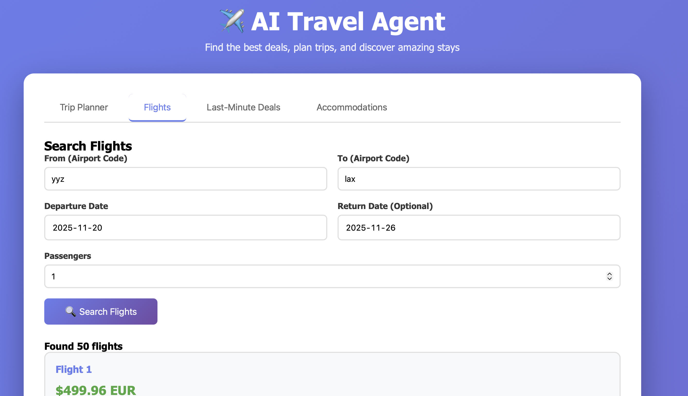

<div align="center">

# ✈️ AI Travel Agent

### Your Intelligent Travel Companion



*An intelligent travel assistant that helps you find the best flight deals, plan trips within your budget, discover last-minute offers, and search for Airbnb accommodations.*

[](LICENSE)
[](https://nodejs.org/)
[](https://github.com/vidhipitroda/AI-travel-agent-/pulls)

</div>

---

## 🌟 Features

- **Smart Trip Planning**: AI-powered trip planning that optimizes your budget for flights and accommodations
- **Flight Search**: Search for flights between any airports with flexible date options
- **Last-Minute Deals**: Discover spontaneous travel opportunities from your local airport
- **Airbnb Integration**: Find and filter accommodation options based on your preferences and budget
- **Budget Optimization**: Get AI recommendations on how to best allocate your travel budget
- **Real-time Pricing**: Access up-to-date flight and accommodation prices

## 🚀 Getting Started

### Prerequisites

- Node.js (v18 or higher)
- npm or yarn
- API Keys for:
  - OpenAI (for AI agent functionality)
  - Amadeus (for flight data)
  - RapidAPI (for Airbnb data)

### API Keys Setup

1. **OpenAI API Key**
   - Sign up at [OpenAI](https://platform.openai.com/)
   - Create an API key from the dashboard

2. **Amadeus API**
   - Register at [Amadeus for Developers](https://developers.amadeus.com/)
   - Create a new app to get your API key and secret
   - Note: Use the test environment for development

3. **Airbnb API (via RapidAPI)**
   - Sign up at [RapidAPI](https://rapidapi.com/)
   - Subscribe to the [Airbnb API](https://rapidapi.com/3b-data-3b-data-default/api/airbnb13)
   - Copy your RapidAPI key

### Installation

1. **Clone the repository**
   ```bash
   git clone https://github.com/vidhipitroda/AI-travel-agent-.git
   cd AI-travel-agent-
   ```

2. **Install Backend Dependencies**
   ```bash
   cd Backend
   npm install
   ```

3. **Configure Environment Variables**
   
   Create a `.env` file in the Backend directory:
   ```bash
   cp .env.example .env
   ```
   
   Edit `.env` and add your API keys:
   ```
   OPENAI_API_KEY=your_openai_api_key_here
   AMADEUS_API_KEY=your_amadeus_api_key_here
   AMADEUS_API_SECRET=your_amadeus_api_secret_here
   AIRBNB_API_KEY=your_rapidapi_key_here
   PORT=3000
   NODE_ENV=development
   ```

4. **Start the Backend Server**
   ```bash
   npm start
   # or for development with auto-reload
   npm run dev
   ```

5. **Open the Frontend**
   
   Open `Frontend/index.html` in your browser, or use a simple HTTP server:
   ```bash
   cd ../Frontend
   python -m http.server 8080
   # Then visit http://localhost:8080
   ```

## 📖 Usage

### Trip Planner
1. Navigate to the "Trip Planner" tab
2. Enter your origin and destination airport codes (e.g., JFK, LAX)
3. Select your travel dates
4. Set your total budget
5. Click "Plan My Trip"
6. Review AI recommendations and available options

### Flight Search
1. Go to the "Flights" tab
2. Enter origin and destination
3. Select departure (and optional return) dates
4. Specify number of passengers
5. Click "Search Flights"

### Last-Minute Deals
1. Click on "Last-Minute Deals" tab
2. Enter your origin airport
3. Set maximum price
4. Discover spontaneous travel opportunities

### Accommodations
1. Navigate to "Accommodations" tab
2. Enter destination city
3. Select check-in and check-out dates
4. Specify number of guests
5. Optionally set max price per night
6. Search for stays

## 🏗️ Project Structure

```
AI-travel-agent-/
├── Backend/
│   ├── config/
│   │   └── apiConfig.js          # API configuration
│   ├── routes/
│   │   ├── flightRoutes.js       # Flight endpoints
│   │   ├── accommodationRoutes.js # Accommodation endpoints
│   │   └── tripPlannerRoutes.js  # Trip planning endpoints
│   ├── services/
│   │   ├── flightService.js      # Amadeus API integration
│   │   ├── accommodationService.js # Airbnb API integration
│   │   └── aiAgentService.js     # OpenAI integration
│   ├── server.js                 # Express server
│   ├── package.json
│   └── .env                      # Environment variables (create this)
├── Frontend/
│   ├── index.html                # Main UI
│   └── app.js                    # Frontend logic
├── .gitignore
└── README.md
```

## 🔌 API Endpoints

### Trip Planner
- `POST /api/trip-planner/plan` - Plan a complete trip
- `POST /api/trip-planner/chat` - Chat with AI agent

### Flights
- `POST /api/flights/search` - Search for flights
- `GET /api/flights/last-minute-deals` - Get last-minute deals
- `POST /api/flights/by-price` - Filter flights by price

### Accommodations
- `POST /api/accommodation/search` - Search accommodations
- `POST /api/accommodation/deals` - Get accommodation deals

## 💡 Tips

- **Budget Planning**: Allocate ~60% of your budget for flights and 40% for accommodation
- **Flexible Dates**: Use the last-minute deals feature for flexible travel dates
- **Airport Codes**: Use standard IATA codes (3 letters) for airports
- **Best Deals**: Book during off-peak seasons and weekdays for better prices

## 🛠️ Development

To run in development mode with auto-reload:
```bash
cd Backend
npm run dev
```

## 📝 Notes

- The Amadeus API has rate limits on the free tier
- Airbnb API may return mock data if the RapidAPI key is not configured
- OpenAI API calls are required for AI recommendations

## 🤝 Contributing

Contributions are welcome! Please feel free to submit a Pull Request.

## 📄 License

ISC

## 🙏 Acknowledgments

- [Amadeus for Developers](https://developers.amadeus.com/) - Flight data
- [OpenAI](https://openai.com/) - AI capabilities
- [RapidAPI](https://rapidapi.com/) - API marketplace
